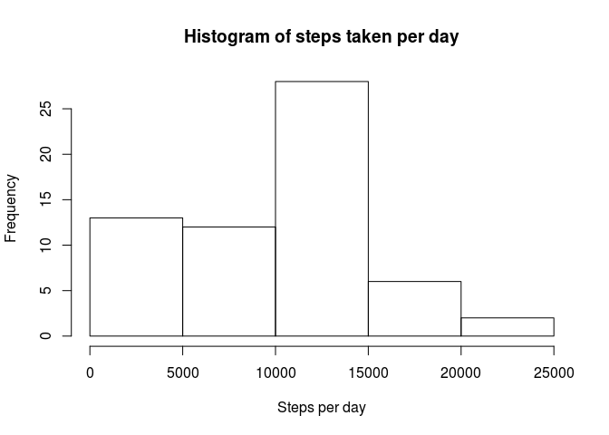
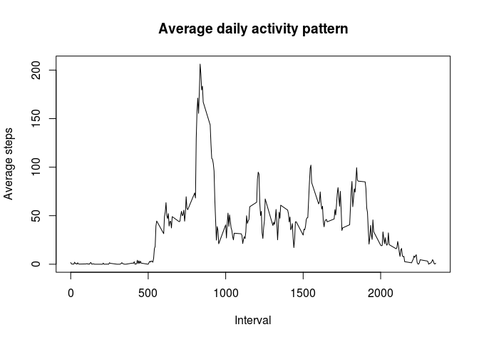
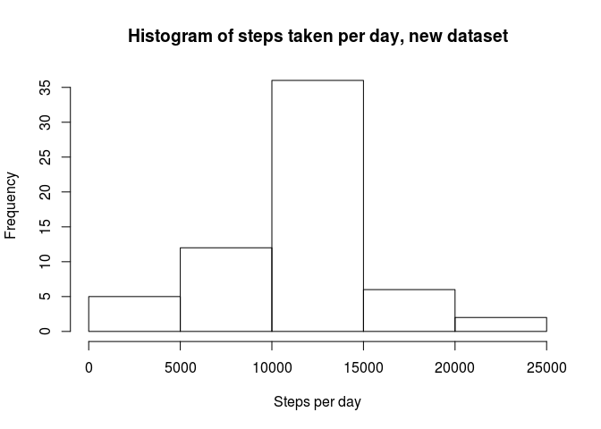
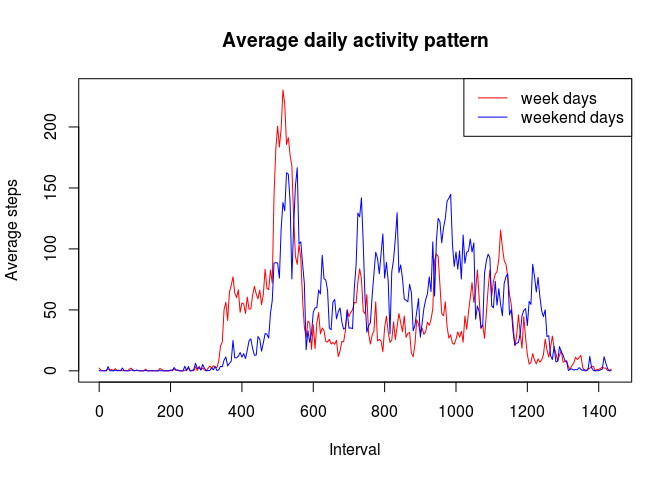

# Reproducible Research: Peer Assessment 1
## Loading and preprocessing the data
Reading from the zip file the activity data frame, no additional transformation required:


```r
library(dplyr)
```

```
## 
## Attaching package: 'dplyr'
```

```
## The following objects are masked from 'package:stats':
## 
##     filter, lag
```

```
## The following objects are masked from 'package:base':
## 
##     intersect, setdiff, setequal, union
```

```r
library(lubridate)
```

```
## 
## Attaching package: 'lubridate'
```

```
## The following object is masked from 'package:base':
## 
##     date
```

```r
act<-read.csv("activity.csv", stringsAsFactors = F)
head(act)
```

```
##   steps       date interval
## 1    NA 2012-10-01        0
## 2    NA 2012-10-01        5
## 3    NA 2012-10-01       10
## 4    NA 2012-10-01       15
## 5    NA 2012-10-01       20
## 6    NA 2012-10-01       25
```

## What is mean total number of steps taken per day?
First showing histogram of steps taken by day:

```r
act1<-act %>%
      group_by(date) %>%
      summarise(daily_steps = sum(steps, na.rm = TRUE))
hist(act1$daily_steps, main = "Histogram of steps taken per day", xlab = "Steps per day")
```

<!-- -->

Now calculating the mean and the median of steps taken per day


```r
mean(act1$daily_steps)
```

```
## [1] 9354.23
```

```r
median(act1$daily_steps)
```

```
## [1] 10395
```

## What is the average daily activity pattern?

Time series of the daily activity pattern:


```r
act2<-act %>%
      group_by(interval) %>%
      summarise(interv_steps = mean(steps, na.rm = TRUE))
plot(act2$interval, act2$interv_steps, type= "l", main = "Average daily activity pattern", xlab = "Interval", ylab = "Average steps")
```

<!-- -->

5 minute interval that contains the maximum average number of steps:


```r
act2[which.max(act2$interv_steps),]
```

```
## # A tibble: 1 x 2
##   interval interv_steps
##      <int>        <dbl>
## 1      835     206.1698
```

## Imputing missing values

Total of missing values in the dataset:


```r
sum(is.na(act$steps))
```

```
## [1] 2304
```

I'll use the mean value for each interval to fill the NA values in the dataset:


```r
act3<-act
head(act3)
```

```
##   steps       date interval
## 1    NA 2012-10-01        0
## 2    NA 2012-10-01        5
## 3    NA 2012-10-01       10
## 4    NA 2012-10-01       15
## 5    NA 2012-10-01       20
## 6    NA 2012-10-01       25
```

```r
act3$interval<-as.factor(act3$interval)
for(i in levels(act3$interval)){
      act3$steps[act3$interval == i & is.na(act3$steps)]<-act2$interv_steps[act2$interval== i]
}
```
new dataset with NA filled with interval mean:


```r
head(act3)
```

```
##       steps       date interval
## 1 1.7169811 2012-10-01        0
## 2 0.3396226 2012-10-01        5
## 3 0.1320755 2012-10-01       10
## 4 0.1509434 2012-10-01       15
## 5 0.0754717 2012-10-01       20
## 6 2.0943396 2012-10-01       25
```

histogram for the new dataset:


```r
act4<-act3 %>%
      group_by(date) %>%
      summarise(daily_steps = sum(steps))
hist(act4$daily_steps, main = "Histogram of steps taken per day, new dataset", xlab = "Steps per day")
```

<!-- -->

Mean and median calculations


```r
mean(act4$daily_steps)
```

```
## [1] 10766.19
```

```r
median(act4$daily_steps)
```

```
## [1] 10766.19
```

## Are there differences in activity patterns between weekdays and weekends?

Creating the factor column in the "filled missings" dataset for type of day. The factor has two levels: weekend_day and weekday.

```r
act5<-act3
act5<-act5%>%
      mutate(date=ymd(date))%>%
      mutate(type_day=ifelse(weekdays(date)=="Sunday" | weekdays(date)=="Saturday", TRUE, FALSE))
act5$type_day<-as.factor(act5$type_day)
levels(act5$type_day)<-c("weekend_day", "week_day")
head(act5)
```

```
##       steps       date interval    type_day
## 1 1.7169811 2012-10-01        0 weekend_day
## 2 0.3396226 2012-10-01        5 weekend_day
## 3 0.1320755 2012-10-01       10 weekend_day
## 4 0.1509434 2012-10-01       15 weekend_day
## 5 0.0754717 2012-10-01       20 weekend_day
## 6 2.0943396 2012-10-01       25 weekend_day
```

```r
class(act5$type_day)
```

```
## [1] "factor"
```

generating the activity pattern dataset for week days and weekend days:


```r
wdays<-act5%>%
      filter(type_day=="weekend_day")%>%
      group_by(interval)%>%
      summarise(interv_steps = mean(steps))%>%
      mutate(interval=(as.integer(interval)-1)*5)
edays<-act5%>%
      filter(type_day=="week_day")%>%
      group_by(interval)%>%
      summarise(interv_steps = mean(steps))%>%
      mutate(interval=(as.integer(interval)-1)*5)
```

Plotting the comparison between week days and weekend days:


```r
plot(wdays$interval, wdays$interv_steps, type= "l", col="red", main = "Average daily activity pattern", xlab = "Interval", ylab = "Average steps")
lines(edays$interval, edays$interv_steps, type= "l", col="blue")
legend("topright", legend=c("week days", "weekend days"), col=c("red", "blue"), lwd = 1)
```

<!-- -->

On week days the subject walks more intensively between minute 500 and 600, on weekends subject walks more at diverse moments during the day.
